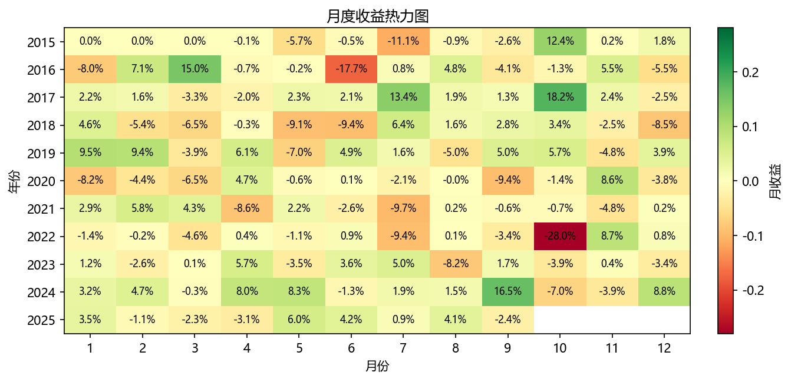
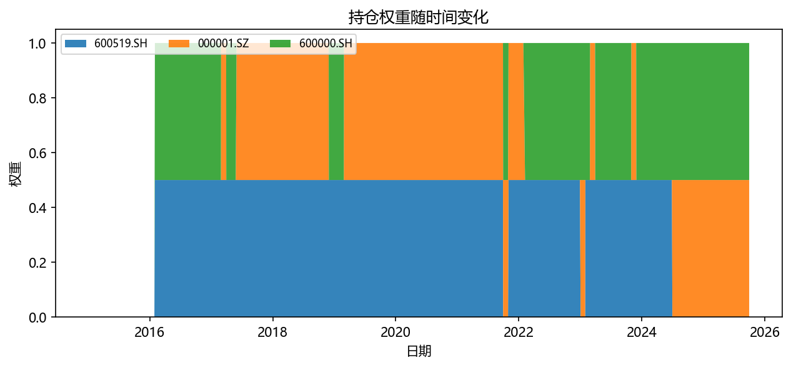

# Quant Backtest Portfolio AkShare

轻量级 A 股量化回测示例项目，基于 Python、pandas 和 AkShare，覆盖数据获取、策略信号、组合回测、绩效评估和可视化报告。

这个仓库适合两类人：

- 想快速学习 A 股量化回测基本流程的投资者和学生
- 想基于 AkShare 搭一个轻量策略研究模板的 Python 用户

## 功能亮点

- A 股和常见 ETF 日线数据获取与本地缓存
- 前复权行情默认处理，减少价格跳变对回测的影响
- YAML 配置驱动，股票池、基准、时间区间、手续费和策略参数都可修改
- 命令行入口，支持快速覆盖输出目录、起止日期和股票池
- 策略示例：双均线择时、增强双均线、12-1 动量轮动、趋势过滤动量、动量低波多因子、低波动组合、风险平价
- 成本模型：按换手率扣减交易成本
- 输出净值、回撤、超额收益、持仓权重、月度收益热力图
- 关键指标汇总：年化收益率、年化波动率、夏普比率、最大回撤、卡玛比率、胜率、换手率
- 基础单元测试和 GitHub Actions，方便继续扩展策略

## 项目结构

```text
.
├── main.py                 # 一键运行示例回测
├── configs/
│   └── demo.yaml           # 示例配置文件
├── src/
│   ├── cli.py              # 命令行入口
│   ├── runner.py           # 策略运行编排
│   ├── config_loader.py    # YAML 配置加载
│   ├── config.py           # 示例参数
│   ├── data.py             # AkShare 数据获取与缓存
│   ├── strategies.py       # 策略权重生成
│   ├── backtest.py         # 组合回测引擎
│   ├── metrics.py          # 绩效指标
│   └── plotting.py         # 图表输出
├── tests/                  # 基础单元测试
├── data/                   # 示例缓存数据
└── output/                 # 示例输出图表与报表
```

## 快速开始

```bash
python -m venv .venv
.venv\Scripts\activate
pip install -r requirements.txt
python main.py
```

运行后会在 `output/` 下生成图表和 CSV 报表。

## 使用配置文件运行

```bash
python -m src.cli --config configs/demo.yaml
```

临时覆盖参数：

```bash
python -m src.cli --config configs/demo.yaml --output-dir output/demo_etf --start 2018-01-01 --assets 510300.SH 159915.SZ
```

配置文件示例：

```yaml
assets:
  - 600519.SH
  - 000001.SZ
  - 600000.SH
baseline: 600519.SH
start: "2015-01-01"
cost_bps: 10

strategies:
  sma:
    enabled: true
    short_window: 30
    long_window: 50
    grid_search:
      enabled: true
      short_windows: [10, 20, 30]
      long_windows: [50, 60, 120]
      objective: 夏普比率
  enhanced_sma:
    enabled: true
    short_window: 30
    long_window: 50
    band: 0.01
    confirm_days: 3
    stop_loss_pct: 0.08
    trailing_stop_pct: 0.12
    target_vol: 0.18
  momentum:
    enabled: true
    lookback: 12
    skip: 1
    top_n: 2
```

## 示例结果

### 净值曲线


### 月度收益热力图



### 持仓权重



## 策略说明

### 双均线交叉

短期均线向上突破长期均线时持有标的，否则切换为空仓现金。适合展示趋势跟随和择时逻辑。

### 增强双均线

在普通双均线基础上加入多层风控：

- 突破阈值带：短均线必须超过长均线一定比例，减少噪音假突破
- 连续确认：突破需要持续若干天才进场，避免单日脉冲
- 长均线趋势过滤：长均线走平或下行时不轻易做多
- 固定止损和移动止损：控制单次错误信号的损失
- 波动率目标仓位：波动率高时自动降仓，波动率低时保持更高仓位
- 参数扫描：输出 `双均线_参数扫描.csv`，用于比较不同短/长均线组合

### 12-1 动量轮动

每月计算过去 12 个月到过去 1 个月之间的累计收益，跳过最近 1 个月，选择动量排名靠前的标的等权持有。

### 趋势过滤动量

在相对动量基础上增加绝对动量过滤：只有动量分数大于阈值的资产才会被持有。默认使用反波动率加权，让组合少依赖高波动资产。

### 低波动组合

每月选择过去一段时间历史波动率最低的标的，适合作为稳健组合和因子策略入门示例。

### 动量低波多因子

用动量排名和低波动排名合成分数，再选择综合分数靠前的标的。它比单一动量更稳健，也比单一低波更有进攻性。

### 风险平价

按过去一段时间的波动率倒数分配权重，目标是让低波动资产获得更高权重，降低单一高波动资产对组合的冲击。

## 运行测试

```bash
pytest
```

## 后续路线图

- 增加可安装包入口，例如 `quantbt run --config configs/demo.yaml`
- 支持更多资产池：宽基 ETF、行业 ETF、指数、可转债
- 增加更多策略：多因子打分、均值方差、定投择时
- 增加 Streamlit 可视化面板
- 增加参数扫描和批量回测报告

## 免责声明

本项目仅用于量化研究和编程学习，不构成任何投资建议。历史回测结果不代表未来收益。
