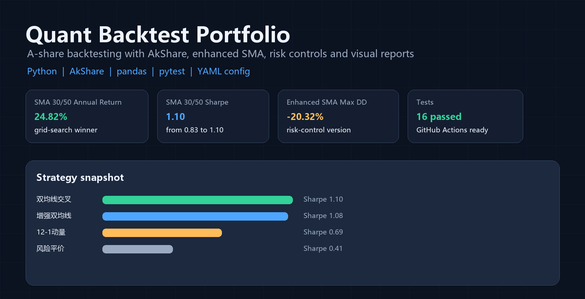
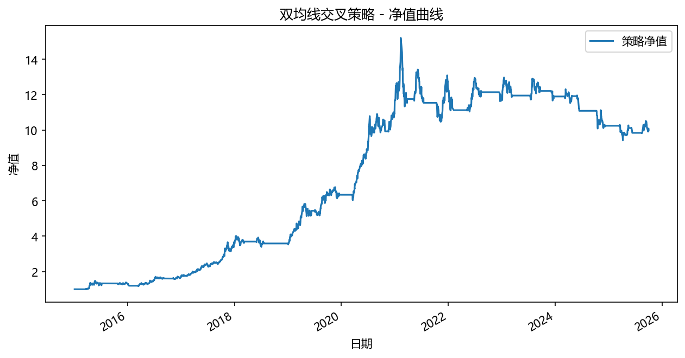
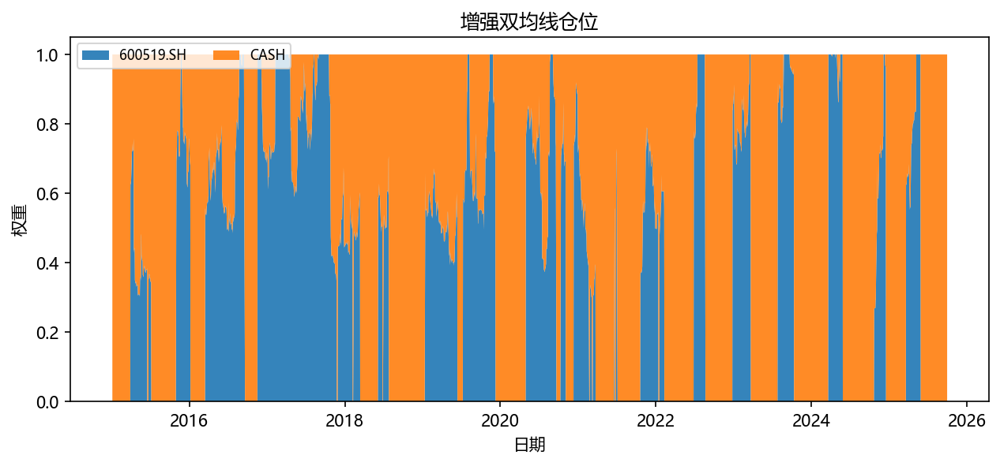
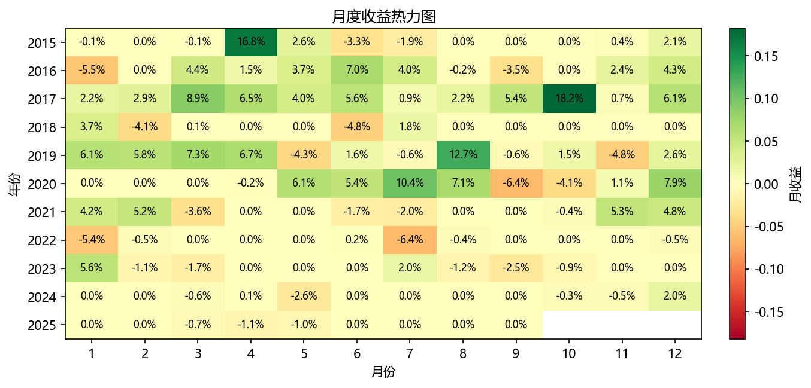

# Quant Backtest Portfolio AkShare

[](https://github.com/PandOvo/quant-backtest-portfolio_akshare/actions/workflows/tests.yml)




面向 A 股量化学习者的轻量级回测框架。项目基于 Python、pandas 和 AkShare，覆盖数据获取、策略信号、组合回测、绩效评估和可视化报告。

它不是一个“神奇收益率”项目，而是一个可以直接拆开学习、改参数、扩展策略的研究模板。

## 为什么值得 Star

- 开箱即跑：`python main.py` 生成净值、回撤、仓位、月度收益热力图和指标报表
- A 股友好：使用 AkShare 获取 A 股/ETF 日线数据，并支持本地缓存
- 策略可研究：支持 YAML 配置、命令行覆盖参数、参数扫描和多策略横向对比
- 双均线加强：包含普通双均线、参数扫描最优组合、增强双均线风控版本
- 风控不缺席：交易成本、止损、移动止损、趋势过滤、波动率目标仓位
- 工程可扩展：模块化 `data / strategies / backtest / metrics / plotting / runner`
- CI 已接入：GitHub Actions 自动跑 `pytest`

## 当前示例结果

示例股票池：`600519.SH`、`000001.SZ`、`600000.SH`  
基准：`600519.SH`  
区间：`2015-01-01` 至最新缓存数据

| 策略 | 年化收益 | 夏普 | 最大回撤 | 年化波动 | 风格 |
|---|---:|---:|---:|---:|---|
| 双均线交叉 30/50 | 24.82% | 1.10 | -38.10% | 22.40% | 进攻型趋势跟随 |
| 增强双均线 | 14.55% | 1.08 | -20.32% | 13.47% | 风控型趋势跟随 |
| 趋势过滤动量 | 16.44% | 0.73 | -50.34% | 25.20% | 轮动进攻 |
| 12-1 动量 | 13.75% | 0.69 | -46.84% | 22.23% | 经典动量 |
| 风险平价 | 6.39% | 0.41 | -45.69% | 20.20% | 低换手配置 |

完整报表见：

- [量化投资策略报告.pdf](量化投资策略报告.pdf)
- [总览_指标汇总.csv](output/reports/总览_指标汇总.csv)
- [双均线_参数扫描.csv](output/reports/双均线_参数扫描.csv)

## 快速开始

```bash
git clone https://github.com/PandOvo/quant-backtest-portfolio_akshare.git
cd quant-backtest-portfolio_akshare

python -m venv .venv
.venv\Scripts\activate
pip install -r requirements.txt

python main.py
```

运行后会在 `output/` 下生成图表和 CSV 报表。

## 使用配置文件运行

```bash
python -m src.cli --config configs/demo.yaml
```

临时覆盖参数：

```bash
python -m src.cli --config configs/demo.yaml --output-dir output/demo_etf --start 2018-01-01 --assets 510300.SH 159915.SZ
```

配置文件示例：

```yaml
assets:
  - 600519.SH
  - 000001.SZ
  - 600000.SH
baseline: 600519.SH
start: "2015-01-01"
cost_bps: 10

strategies:
  sma:
    enabled: true
    short_window: 30
    long_window: 50
    grid_search:
      enabled: true
      short_windows: [10, 20, 30]
      long_windows: [50, 60, 120]
      objective: 夏普比率
  enhanced_sma:
    enabled: true
    short_window: 30
    long_window: 50
    band: 0.01
    confirm_days: 3
    stop_loss_pct: 0.08
    trailing_stop_pct: 0.12
    target_vol: 0.18
```

## 策略亮点

### 双均线交叉

短均线向上突破长均线时持有标的，否则切换为空仓现金。当前 demo 通过参数扫描将默认组合从 `20/60` 优化为 `30/50`。

### 增强双均线

在普通双均线基础上加入多层风控：

- 突破阈值带：短均线必须超过长均线一定比例，减少噪音假突破
- 连续确认：突破需要持续若干天才进场，避免单日脉冲
- 长均线趋势过滤：长均线走平或下行时不轻易做多
- 固定止损和移动止损：控制单次错误信号的损失
- 波动率目标仓位：波动率高时自动降仓，波动率低时保持更高仓位
- 参数扫描：输出 `双均线_参数扫描.csv`，用于比较不同短/长均线组合

### 动量与组合策略

- `12-1 动量轮动`：跳过最近 1 个月，选择过去 12 到 1 个月动量靠前资产
- `趋势过滤动量`：只持有动量为正的资产，并使用反波动率加权
- `动量低波多因子`：动量排名和低波排名合成分数
- `低波动组合`：选择历史波动率最低标的
- `风险平价`：按波动率倒数分配权重，降低高波动资产冲击

## 示例图表

### 双均线净值



### 增强双均线仓位



### 增强双均线月度收益



## 项目结构

```text
.
├── main.py                 # 一键运行示例回测
├── configs/
│   └── demo.yaml           # 示例配置文件
├── src/
│   ├── cli.py              # 命令行入口
│   ├── runner.py           # 策略运行编排
│   ├── config_loader.py    # YAML 配置加载
│   ├── data.py             # AkShare 数据获取与缓存
│   ├── strategies.py       # 策略权重生成
│   ├── backtest.py         # 组合回测引擎
│   ├── metrics.py          # 绩效指标
│   └── plotting.py         # 图表输出
├── tests/                  # 单元测试
├── docs/assets/            # README 与社交预览图素材
├── data/                   # 示例缓存数据
└── output/                 # 示例输出图表与报表
```

## 运行测试

```bash
pytest
```

## 生成策略报告 PDF

```bash
python scripts/generate_strategy_report.py
```

## 路线图

- 增加可安装包入口，例如 `quantbt run --config configs/demo.yaml`
- 增加参数扫描热力图和自动选参报告
- 支持宽基 ETF、行业 ETF、指数、可转债等更多资产池
- 增加均值方差、定投择时、行业轮动等策略
- 增加 Streamlit 可视化面板
- 增加英文 README，方便海外开发者阅读

## 免责声明

本项目仅用于量化研究和编程学习，不构成任何投资建议。历史回测结果不代表未来收益。
